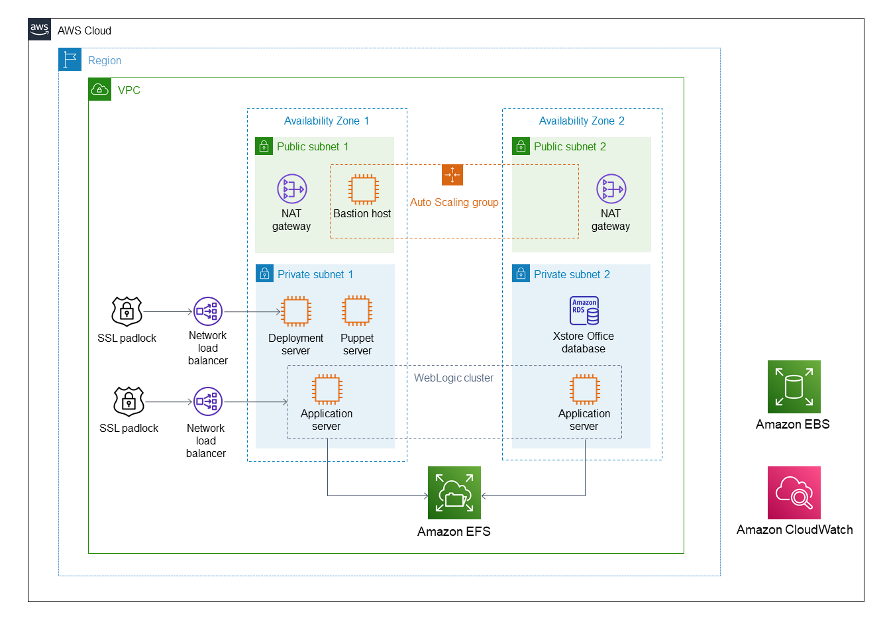

Deploying this Quick Start for a new virtual private cloud (VPC) with default parameters builds the following {partner-product-name} environment in the AWS Cloud.

// Replace this example diagram with your own. Send us your source PowerPoint file. Be sure to follow our guidelines here : http://(we should include these points on our contributors giude)
:xrefstyle: short
[#architecture1]
.Quick Start architecture for {partner-product-name} on AWS

As shown in <<architecture1>>, the Quick Start sets up the following:

* A highly available architecture that spans two Availability Zones.*
* A VPC configured with public and private subnets, according to AWS best practices, to provide you with your own virtual network on AWS.*

* In the public subnets:

** Managed network address translation (NAT) gateways to allow outbound internet access for resources in the private subnets.*
** A Linux bastion host in an Auto Scaling group to allow inbound Secure Shell (SSH) access to Amazon EC2 instances in public and private subnets.*

* In the private subnets:
// Add bullet points for any additional components that are included in the deployment. Make sure that the additional components are also represented in the architecture diagram.

** An Amazon RDS Oracle database storing the XCenter, XCenter replication, and XAdmin databases.
** An Apache Tomcat deployment server running on an Amazon EC2 instance for deployments from Oracle Retail Xstore Office.
** Oracle WebLogic cluster nodes running on Amazon EC2 instances for the deployment of Oracle Retail Xstore Office applications.
** A Puppet server running on an Amazon EC2 instance for Apache tomcat installation, Oracle WebLogic cluster installation, and data loader execution.

* Amazon Elastic File System (Amazon EFS) mounted by all the instances that are part of the WebLogic cluster. 
* Amazon Data Lifecycle Manager (Amazon DLM) to automate the creation, retention, and deletion of snapshots of the Amazon Elastic Block Storage (Amazon EBS) volumes.
* Amazon CloudWatch for infrastructure monitoring.

*The template that deploys the Quick Start into an existing VPC skips the components marked by asterisks and prompts you for your existing VPC configuration. 
